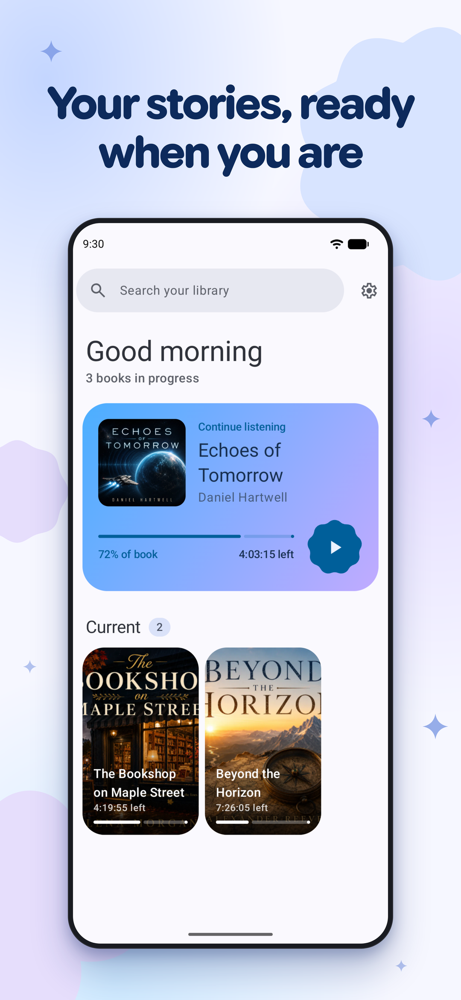
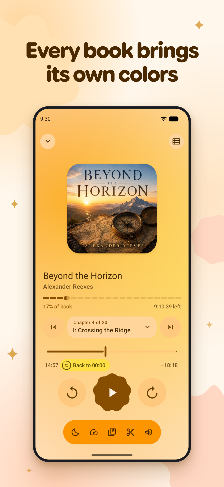
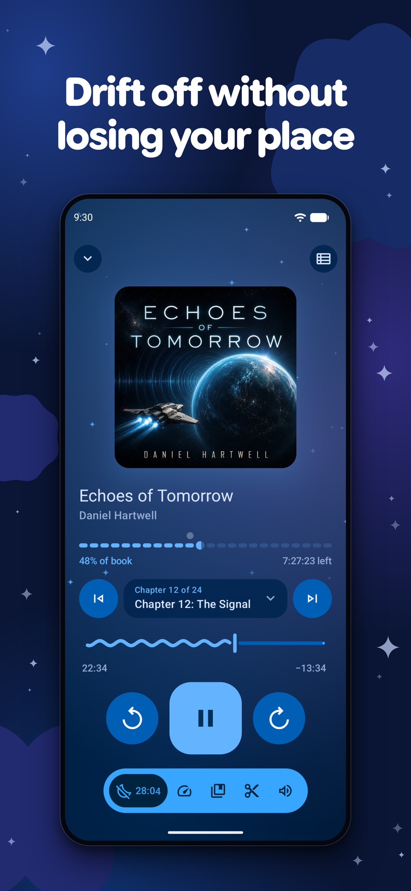

# Voice

**A clean, user-focused audiobook player for Android, built to be reliable and a joy to use.**

Voice turns your own audiobook files into a calm, focused listening library. It remembers where you stopped, keeps playback controls close, and includes the audiobook-specific details that generic music players miss: chapter navigation, sleep timer, bookmarks, playback speed, silence skipping, and auto-rewind after pauses.

  
  
  

## Why Voice?

- **Made for your files:** Add a folder once and Voice organizes your local M4B, MP3, M4A, OGG, OGA, and OPUS audiobooks.
- **Built for listening:** Resume positions, bookmarks, sleep timer fade-out, volume boost, speed control, and Android Auto support are part of the core experience.
- **Private and uncluttered:** No account, no ads, no forced cloud sync. Your library stays on your device.

## Download

## Learn more

The [documentation website](https://voice.woitaschek.de) covers features, the philosophy behind the app, how to organize your library, and the FAQ.

## Contributing

Bug reports, feature requests, and bug fixes are very welcome. Anything other than a bug fix needs the maintainer's approval before you open a pull request, so please read the [Contributing guide](https://voice.woitaschek.de/contributing/) first. For code, start with [Development](https://voice.woitaschek.de/development/) and [Architecture](https://voice.woitaschek.de/architecture/).

## Support Voice

Voice is free and built in spare time. If it has been useful to you, consider chipping in. One-time or monthly, no sign-up required:

You can also [sponsor on GitHub](https://github.com/sponsors/PaulWoitaschek) if you prefer.

## License

Voice is licensed under [GNU GPLv3](https://voice.woitaschek.de/license/). By contributing, you agree to license your code under the same terms.
