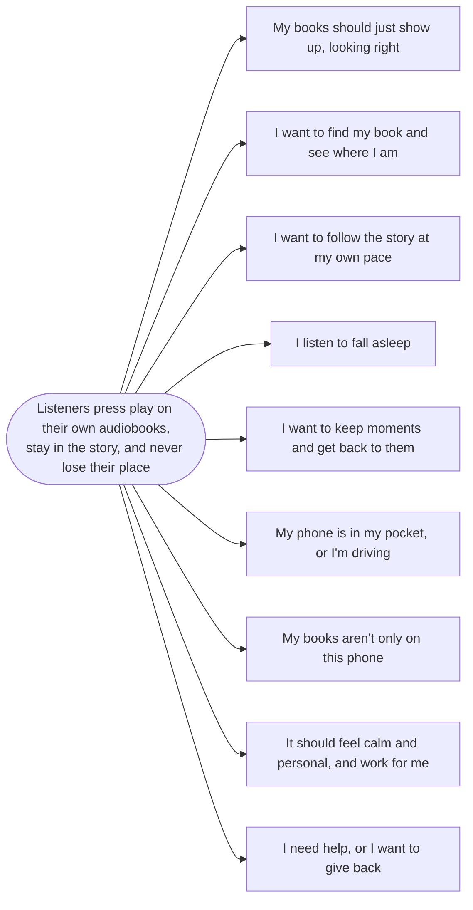

# Voice

**Status:** Outline. This is the tree for the whole app. Each area has its own spec, linked below.

## Outcome

Listeners press play on their own audiobooks, stay in the story, and never lose their place.

## Who

Mostly people who "just randomly throw in audiobook files and they just want to play it." ([#3044]) Power users matter
too, as long as "The basic usage is simple and there are features for power users without complicating the basic
usage." ([#1034])

## The tree

| Opportunity | Main problems in it | Spec |
|---|---|---|
| My books should just show up, looking right | Picking the folder layout, wrong names, missing chapters, losing everything after a move | [Getting started](getting-started.md) |
| I want to find my book and see where I am | Sorting, series, progress, editing details, stats | [Library](library.md) |
| I want to follow the story at my own pace | Position I can trust, speed for every book, time left, seeking long books | [Player](player.md) |
| I listen to fall asleep | Stopping reliably, end of chapter, getting more time without unlocking | [Sleep timer](sleep-timer.md) |
| I want to keep moments and get back to them | Saving without stopping, finding bookmarks, undoing a slip, export | [Bookmarks and history](bookmarks.md) |
| My phone is in my pocket, or I'm driving | Car, headphone buttons, the lock screen slider, widgets, casting | [Outside the app](outside-the-app.md) |
| My books aren't only on this phone | Own server, cloud storage, two devices, a new phone | [Servers, sync and backup](servers-and-sync.md) |
| It should feel calm and personal, and work for me | Dark mode, pure black, color, accessibility, languages | [Look and feel](look-and-feel.md) |
| I need help, or I want to give back | Supporting Voice, getting help, privacy, which build to install | [Feedback and support](feedback-and-support.md) |

## Most wanted, still open

These are the open ideas with the most upvotes on a single thread. Duplicates add more. Sorting, for example, has only
8 upvotes on [#1543] but about 59 across 15 threads.

| Upvotes | Idea | Spec |
|---|---|---|
| 28 | Back up progress and bookmarks ([#1668]) | [Servers, sync and backup](servers-and-sync.md) |
| 25 | A pure black theme ([#1284]) | [Look and feel](look-and-feel.md) |
| 20 | A default playback speed ([#1790]) | [Player](player.md) |
| 16 | Series ([#1748]) | [Library](library.md) |
| 14 | Export bookmarks ([#2549]) | [Bookmarks and history](bookmarks.md) |
| 13 | Cloud storage ([#1294]) | [Servers, sync and backup](servers-and-sync.md) |
| 12 | Turn off seeking on the lock screen ([#3229]) | [Outside the app](outside-the-app.md) |
| 11 | Edit a book's details ([#1407]) | [Library](library.md) |
| 10 | Speed in Android Auto ([#1878]) | [Outside the app](outside-the-app.md) |

Server support ([#2385], 17 upvotes) is also still open, but the Audiobookshelf preview answers it.

## Principles

These limit every solution in every area.

- **Clean, not minimal.** "I add features when they make listening better for many listeners. Each one has to be
  maintained for years, and every new setting makes the app a bit harder to use." ([FAQ](../docs/faq.md))
- **Good defaults before settings.** "I don't want voice to be really customizable. I want to provide good defaults and
  don't distract the user." ([#795]) "It's mostly not about the maintenance cost. I'ts about providing good defaults
  and having a simple ui." ([#860])
- **The data stays with the listener.** No account, no ads, nothing behind a paywall, and no Voice server
  ([design principles]).
- **Never interrupt listening.** Prompts wait for a calm moment, ask once, and accept no ([design principles]).
- **Reliable before new.** A feature that fails quietly is worse than none. End of chapter was reverted until it had
  tests ([Sleep timer](sleep-timer.md)).
- **Product before code.** "Before we jump into the technical solutions we need a solid product concept." ([#3044])

## What Voice isn't

- **A podcast or music player**: "This is no music player but an audiobook player." ([#970]) "For this I recommend
  dedicated podcast players like AntennaPod :)" ([#648])
- **An app for other platforms**: "I want to focus on the Android App." ([#83])
- **A store or a way to find books.** Requests exist, for LibriVox for example ([#1296]), but no decision is on record.
- **Undecided: reading along**, with ebooks ([#1635]) or subtitles ([#1671]). Both are open, with no position from the
  maintainer.

## How decisions get made

- **Demand**: upvotes on ideas ([#1330]).
- **Data**: opt-in analytics in the Play build ([#3212]).
- **Tests before release**: tester builds, feature flags and previews, like Audiobookshelf ([#3863]).
- **Who builds**: "Writing code has become cheap. Reviewing and maintaining it has not." New features and UI changes
  come from the maintainer ([CONTRIBUTING.md](../CONTRIBUTING.md)).

## Open questions for the whole app

1. **What does "many listeners" mean in numbers?** There's no threshold. Analytics is the only measure mentioned.
2. **A book identity that survives moves.** One root problem behind renaming ([#2636]), backup ([#1668]) and syncing
   without a server ([#1315]). See [Servers, sync and backup](servers-and-sync.md).
3. **Reading along**: in or out?

[design principles]: ../.agents/skills/design/SKILL.md
[#83]: https://github.com/PaulWoitaschek/Voice/issues/83
[#648]: https://github.com/PaulWoitaschek/Voice/issues/648
[#795]: https://github.com/PaulWoitaschek/Voice/issues/795
[#860]: https://github.com/PaulWoitaschek/Voice/issues/860
[#970]: https://github.com/PaulWoitaschek/Voice/issues/970
[#1034]: https://github.com/PaulWoitaschek/Voice/issues/1034
[#1284]: https://github.com/PaulWoitaschek/Voice/discussions/1284
[#1294]: https://github.com/PaulWoitaschek/Voice/discussions/1294
[#1296]: https://github.com/PaulWoitaschek/Voice/discussions/1296
[#1315]: https://github.com/PaulWoitaschek/Voice/discussions/1315
[#1330]: https://github.com/PaulWoitaschek/Voice/discussions/1330
[#1407]: https://github.com/PaulWoitaschek/Voice/discussions/1407
[#1543]: https://github.com/PaulWoitaschek/Voice/discussions/1543
[#1635]: https://github.com/PaulWoitaschek/Voice/discussions/1635
[#1668]: https://github.com/PaulWoitaschek/Voice/discussions/1668
[#1671]: https://github.com/PaulWoitaschek/Voice/discussions/1671
[#1748]: https://github.com/PaulWoitaschek/Voice/discussions/1748
[#1790]: https://github.com/PaulWoitaschek/Voice/discussions/1790
[#1878]: https://github.com/PaulWoitaschek/Voice/discussions/1878
[#2385]: https://github.com/PaulWoitaschek/Voice/discussions/2385
[#2549]: https://github.com/PaulWoitaschek/Voice/discussions/2549
[#2636]: https://github.com/PaulWoitaschek/Voice/issues/2636
[#3044]: https://github.com/PaulWoitaschek/Voice/issues/3044
[#3212]: https://github.com/PaulWoitaschek/Voice/pull/3212
[#3229]: https://github.com/PaulWoitaschek/Voice/discussions/3229
[#3863]: https://github.com/PaulWoitaschek/Voice/discussions/3863
